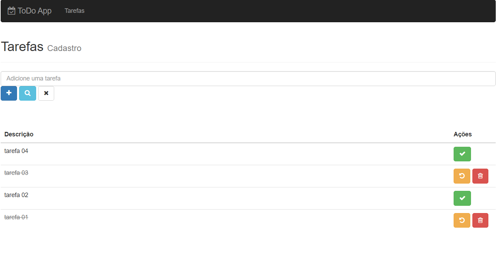

# to-do-app 📅
 Aplicação ToDo List criada no curso de ReactJS da Cod3r Cursos.
 
 
 
 # Tecnologias usadas:
  * NodeJS no backend com Express;
  * PM2;
  * MongoDB e Mongoose;
  * Webpack;
  * ReactJS no frontend(componentes funcionais e de classes);
  * Estilo com Bootstrap;

# Funcionalidades:
 * Criar uma nova tarefa;
 * Buscar por uma tarefa existente;
 * Marcar a tarefa com feita;
 * Desmarcar a tarefa como feita;
 * Excluir a tarefa;
